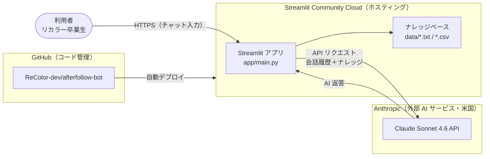
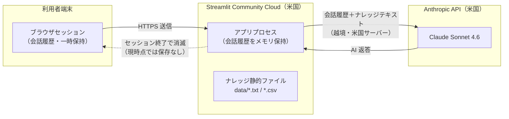
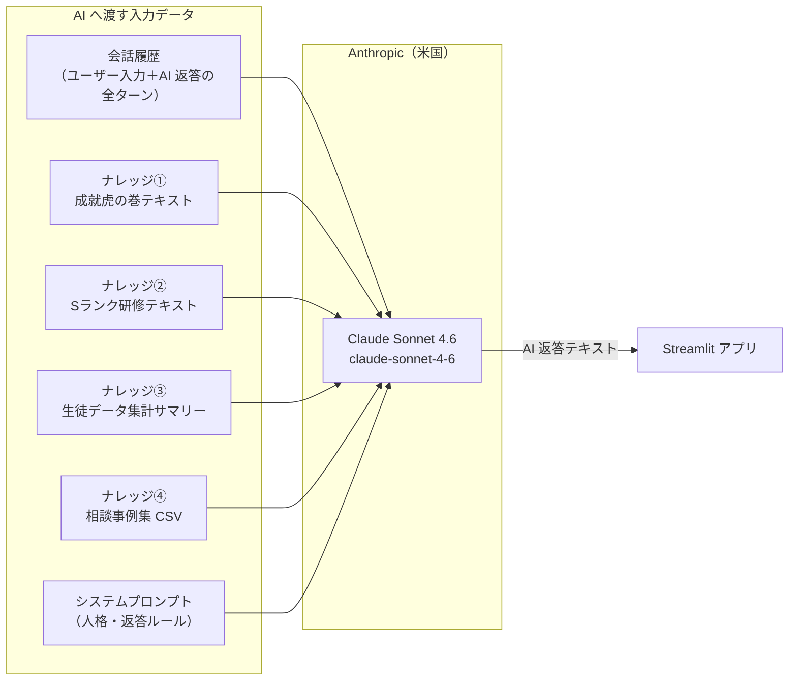

# システム報告資料（情報システム部門 提出用）

> 本資料は対象リポジトリの自動収集とヒアリングに基づく、2026-06-29 時点のスナップショットです。
> インフラ・運用設定の網羅性を保証するものではなく、`[不明/未定]`（サジェスト項目）は記入・確認が必要です。

---

## 0. 概要

| 項目 | 内容 |
|---|---|
| システム名 | Recolor アフターフォローボット（afterfollow-bot） |
| 公開区分 | toC（一般消費者向け） |
| サービスの性質 | リカラー卒業生向け恋愛相談 AI チャットボット |
| 現在のフェーズ | 開発中・β リリース予定（2026-07-01 予定） |
| 作成日 | 2026-06-29 |
| 作成者 | 小家 真由 \<mayu.koie@azone-group.com\> |
| 対象リポジトリ | https://github.com/ReColor-dev/afterfollow-bot |

### 公開判定

| 項目 | 内容 |
|---|---|
| 判定 | **NO-GO** |
| 対象範囲 | β 公開（リカラー卒業生向け） |
| 許可条件 | 下記ブロッカー①〜⑤ の全解消後に再審査 |
| 期限・再審査時期 | ブロッカー解消後、速やかに再提出 |
| 承認者 | [不明/未定]（情シス担当者） |

**公開ブロッカー（解消まで GO 不可）**

| # | ブロッカー | 区分 | 参照 | 状態 |
|---|---|---|---|:---:|
| ① | プライバシーポリシー未整備（toC・個人情報取得前に必須） | 法令 | §14.2 | 未解決 |
| ② | 利用規約未整備（特定商取引法上の表示義務含む） | 法令 | §14.2 | 未解決 |
| ③ | 認証なし（URL 知得者が誰でも利用可能） | 運用 | §8 | 未解決 |
| ④ | API レート制限なし（コスト青天井・DoS 脆弱性） | P0 | §10 | 未解決 |
| ⑤ | インシデント対応フロー未文書化 | 運用 | §11 | 未解決 |

**総評**: Recolor アフターフォローボットは、リカラー卒業生（toC）が恋愛相談を AI と直接対話できる Streamlit ベースのチャットアプリです。会話内容（恋愛相談）を Anthropic API へ送信する設計であり、将来的な個人情報保存計画も含め、toC サービスとして必須のプライバシーポリシー・利用規約が未整備であるほか、認証機能・レート制限・インシデント対応手順のいずれも未実装・未文書化です。明後日（2026-07-01）のリリース目標に対し、現時点では法令対応とセキュリティ面で **NO-GO** 判定とします。最低限ブロッカー①②③④⑤ を解消してから再審査が必要です。

**根拠ラベル**: `[出典: path]` リポジトリで確認 ・ `[ヒアリング]` 担当者回答 ・ `[推定]` 観測からの推定 ・ `[仮定]` 試算上の仮定 ・ `[不明/未定]` 要記入

### 充足状況サマリ

| # | セクション | 状況 | 備考 |
|---|---|:---:|---|
| 1 | 基本情報 | △ | 利用者サポート窓口・体制が未確定 |
| 2 | スケール・ロードマップ | △ | 正式リリース時期・スケール方針が未定 |
| 3 | フェーズ別差分（β / 正式版） | ✗ | 認証・課金・SLA いずれも未定 |
| 4 | システム構成・アーキテクチャ | △ | ホスティング URL・ドメイン未確定 |
| 5 | データ取り扱い | ✗ | 将来保存予定だが保存先・保持期間未定 |
| 6 | AI 利用 | △ | Anthropic の学習ポリシー未文書化 |
| 7 | 外部送信・第三者提供 | △ | 電気通信事業法対応・Cookie 同意未検討 |
| 8 | 認証・認可・アクセス制御 | ✗ | 認証なし |
| 9 | 端末・ネットワーク要件 | △ | IP 制限なし・HTTPS は Streamlit Cloud 依存 |
| 10 | セキュリティ対策 | ✗ | レート制限なし・実 URL 実測未実施 |
| 11 | ログ・監視・インシデント対応 | ✗ | ログなし・対応フロー未文書化 |
| 12 | 可用性・運用・保守 | ✗ | RTO/RPO・バックアップ・BCP 未定 |
| 13 | コスト・キャパシティ・契約 | △ | 試算可能・上限設定なし |
| 14 | 法令・コンプライアンス | ✗ | PP・利用規約・特商法表示なし |
| 15 | 既知のリスク・残課題 | △ | 本資料で列挙 |

凡例: ◯ 確認済 / △ 一部不明 / ✗ 不明・未定

---

## 1. 基本情報

| 項目 | 内容 | 根拠 |
|---|---|---|
| 目的・提供価値 | リカラーの恋愛コンサルティングメソッドを活用し、卒業後の生徒が恋愛相談を AI と対話できる場を提供する | [出典: README.md] |
| 公開区分 | toC（一般消費者向け） | [ヒアリング] |
| サービスの性質 | Web チャットボット（Streamlit）。恋愛相談に対し AI が感情受容→深掘り→アドバイスの 3 ステップで返答 | [出典: app/prompts.py] |
| 想定利用者（エンドユーザー） | リカラーを卒業した元生徒（交際中の方） | [出典: README.md] |
| 管理・運用側の想定 | リカラー社内（現時点で担当者 1 名） | [ヒアリング] |
| 現在のフェーズ / リリース予定 | 開発中。β リリース：2026-07-01 予定 | [ヒアリング] |
| 開発・運用体制 | 小家 真由（単独開発） | [ヒアリング] |
| システム責任者・連絡先（情シス→運用） | 小家 真由 \<koie.mayu_cs@recolor-inc.net\> | [ヒアリング] |
| 利用者向けサポート窓口（利用者→提供側） | [不明/未定] | — |

---

## 2. スケール・ロードマップ

| 項目 | 内容 | 根拠 |
|---|---|---|
| 想定アクセス数（PV / DAU） | 数十名規模（月間アクティブ 10〜100 名） | [ヒアリング] |
| 目標アカウント数（累計） | [不明/未定] | — |
| β リリース予定 | 2026-07-01 | [ヒアリング] |
| 正式リリース予定 | [不明/未定] | — |
| スケール方針 | [不明/未定]（現在は Streamlit Community Cloud の無料枠。ユーザー増加時のスケール計画なし） | [推定] |

---

## 3. フェーズ別差分（β / 正式版）

| 項目 | β（現在） | 正式版（予定） | 根拠 |
|---|---|---|---|
| 公開範囲・対象 | リカラー卒業生（限定案内予定） | [不明/未定] | [ヒアリング] |
| 認証方法 | なし（URL 知得者は誰でも利用可能） | Google ログイン等を検討中 | [推定・ヒアリング] |
| 請求・課金方法 | なし（API コストはリカラー負担） | [不明/未定] | [ヒアリング] |
| レート制限 | なし | [不明/未定] | [出典: app/claude_client.py] |
| SLA・可用性 | Streamlit Community Cloud に依存（SLA なし） | [不明/未定] | [推定] |
| テナント分離 | なし（全ユーザーが同一セッション空間） | [不明/未定] | [出典: app/main.py] |
| データ保持・削除 | 会話はブラウザセッションのみ（サーバー保存なし） | ログイン・履歴保存機能を追加予定 | [ヒアリング] |

---

## 4. システム構成・アーキテクチャ

### 4.1 システム全体構成図

> 根拠: [出典: README.md], [出典: app/claude_client.py], [推定: Streamlit Cloud デプロイ]

### 4.2 技術スタック

| 層 | 採用技術 | バージョン / 備考 |
|---|---|---|
| 言語 | Python | 3.10 以上（requirements.txt より推定） |
| Web フレームワーク | Streamlit | >=1.35.0 |
| AI SDK | anthropic | >=0.49.0 |
| データ処理 | pandas | >=2.2.0 |
| 環境変数管理 | python-dotenv | >=1.0.0 |
| AI モデル | Claude Sonnet 4.6（claude-sonnet-4-6） | Anthropic API |

> 根拠: [出典: requirements.txt], [出典: app/config.py]

### 4.3 構成・インフラ

| 項目 | 内容 | 根拠 |
|---|---|---|
| ホスティング事業者 | Streamlit Community Cloud | [出典: README.md] |
| リージョン | [不明/未定]（Streamlit Cloud はデフォルト米国） | [推定] |
| 構成図・アーキテクチャ図 | 本資料 §4.1 にて初作成（リポジトリ内に既存図なし） | [推定] |
| サービス境界設計 | 単一 Streamlit プロセス。フロント・バック分離なし | [出典: app/main.py] |

### 4.4 ドメイン・DNS・テナント分離

| 項目 | 内容 | 根拠 |
|---|---|---|
| フロントエンドのドメイン | [不明/未定]（Streamlit Cloud のサブドメイン予定） | [ヒアリング] |
| バックエンド / API のドメイン | なし（フロントと一体） | [出典: app/main.py] |
| ドメインレジストラ / ネームサーバー | [不明/未定] | — |
| テナント分離 | なし（単一インスタンスで全ユーザー共有） | [出典: app/main.py] |
| デプロイ分離 | なし | [推定] |

### 4.5 オブジェクトストレージ・CDN

| 項目 | 内容 | 根拠 |
|---|---|---|
| オブジェクトストレージ | 利用なし | [推定: SDK 依存なし] |
| CDN | Streamlit Cloud が提供する静的配信のみ | [推定] |
| ストレージアクセス方式 | 該当なし | — |

### 4.6 利用サービス・設定一覧（PaaS / 外部サービス）

| サービス | 役割 | プラン / リージョン | 主な設定 | 根拠 |
|---|---|---|---|---|
| Streamlit Community Cloud | ホスティング | 無料枠 / 米国（推定） | Main file: app/main.py / Secrets 管理あり | [出典: README.md] |
| Anthropic API | AI 推論（Claude Sonnet 4.6） | 従量課金 / 米国 | プロンプトキャッシュ有効。max_tokens=2048 | [出典: app/config.py] |
| GitHub | ソースコード管理・自動デプロイ | 無料（Organization） | リポジトリ: ReColor-dev/afterfollow-bot | [出典: README.md] |

### 4.7 環境変数一覧

| 変数 | 必須 | 用途 | 備考 |
|---|---|---|---|
| ANTHROPIC_API_KEY | 必須 | Anthropic API 認証 | Streamlit Cloud Secrets に設定済み。実値は非公開 |

> 根拠: [出典: .env.example], [出典: app/config.py]

---

## 5. データ取り扱い

### 5.1 データの保存先・外部送信・越境

> 根拠: [出典: app/claude_client.py], [出典: app/main.py], [ヒアリング]

### 5.2 取り扱いデータ一覧

| データ | 内容・分類 | 保存先 | 機密区分 |
|---|---|---|---|
| 会話履歴（恋愛相談） | ユーザーが入力した相談文・AI 返答 | ブラウザセッションのみ（現在はサーバー保存なし） | 個人情報含みうる（将来保存時は個人情報） |
| ナレッジベーステキスト | リカラー独自メソッド・研修資料 | GitHub リポジトリ・Streamlit Cloud | 社内情報（非個人情報） |
| 生徒データ集計サマリー | 成就率・フェーズ別集計値（個人を特定しない形式） | GitHub リポジトリ・Streamlit Cloud | 統計情報（個人識別不可） |
| ANTHROPIC_API_KEY | API 認証キー | Streamlit Cloud Secrets（暗号化保存） | 秘匿情報 |

> 根拠: [出典: app/knowledge_base.py], [出典: app/main.py], [ヒアリング]

### 5.3 データ保護・管理

| 項目 | 内容 | 根拠 |
|---|---|---|
| 保存期間 | 現在は保存なし。将来保存機能追加時は要設計 | [ヒアリング] |
| 暗号化（通信時） | HTTPS（Streamlit Cloud が提供） | [推定] |
| 暗号化（保存時） | 現在 DB なし。将来保存時は要設計 | [不明/未定] |
| バックアップ | なし（データ保存なし） | [推定] |
| データ主体の権利対応 | [不明/未定]（削除・開示・訂正の手順未設計） | — |
| アカウント停止・削除方針 | アカウント機能なし（現在）。将来実装時に要設計 | [推定] |
| 要配慮個人情報の有無 | 恋愛相談には心理的・感情的な情報が含まれる可能性あり | [推定] |

### 5.4 データ保持・削除 SLA

| 保存先 | 保持期間 | 削除トリガー | 削除完了までの SLA | 根拠 |
|---|---|---|---|---|
| ブラウザセッション | セッション終了まで | タブを閉じる / ページリロード | 即時 | [出典: app/main.py] |
| Anthropic API ログ | Anthropic 社ポリシーに準拠（デフォルト 30 日程度） | [不明/未定] | [不明/未定] | [要確認] |
| 将来の DB（未実装） | [不明/未定] | [不明/未定] | [不明/未定] | — |

---

## 6. AI 利用

### 6.1 AI 送信フロー

> 根拠: [出典: app/claude_client.py], [出典: app/knowledge_base.py], [出典: app/prompts.py]

### 6.2 AI へ渡す入力データ

| データ | 内容 / 備考 |
|---|---|
| システムプロンプト | AIの人格・返答ルール（感情受容→深掘り→アドバイスの3ステップ） |
| 会話履歴（全ターン） | ユーザーの恋愛相談文 + AI の過去返答。セッション中の全メッセージ |
| 成就虎の巻テキスト | リカラー独自の成就メソッド（非個人情報） |
| Sランク研修テキスト | マインド分析・インナーチャイルド理論（非個人情報） |
| 生徒データ集計サマリー | 成就率・フェーズ別統計（個人特定不可な集計値のみ） |
| 相談事例集 CSV | 匿名化された相談パターン事例 |

> 根拠: [出典: app/knowledge_base.py], [出典: app/claude_client.py]

### 6.3 AI 利用の概要

| 項目 | 内容 | 根拠 |
|---|---|---|
| AI / LLM の利用有無 | あり（コア機能） | [出典: app/claude_client.py] |
| 利用設計 | ユーザーの恋愛相談に対してリアルタイムで AI が返答。多ターン会話対応 | [出典: app/main.py] |
| 学習利用の無効化 | `store: false` 設定なし。ただし Anthropic の商用 API は**デフォルトでモデル学習に使わない**ポリシーを採用 | [要確認]（Anthropic 利用規約で文書化が必要） |
| データ保持（Anthropic 側） | Anthropic の API ログポリシーに準拠（デフォルト 30 日程度。要確認） | [要確認] |
| 提供元・モデル | Anthropic / claude-sonnet-4-6 | [出典: app/config.py] |
| プロンプトキャッシュ | ナレッジベースのキャッシュ最適化あり（コスト削減） | [出典: app/prompts.py] |

### 6.4 AI リスク・ガードレール

| 項目 | 内容 | 根拠 |
|---|---|---|
| prompt injection への対策 | なし（ユーザー入力をそのまま API に渡す設計） | [出典: app/claude_client.py] |
| 機密情報の流出防止 | ナレッジベースから生徒個人データの生データは除外し集計値のみ渡す | [出典: app/knowledge_base.py] |
| 出力の検証・human review | なし（AI 返答をそのまま表示） | [出典: app/main.py] |
| 出力ガードレール / フィルタ | なし | [推定] |
| プロンプト・出力のログ | なし（現時点でログ機能なし） | [推定] |
| モデル変更時の再審査 | 手順未定 | [不明/未定] |

---

## 7. 外部送信・第三者提供・外部連携運用

### 7.1 委託先・サブプロセッサ

| サービス | 用途 | 送信・保管データ |
|---|---|---|
| Anthropic（米国） | AI 推論（Claude API） | 会話履歴・システムプロンプト・ナレッジテキスト |
| Streamlit Community Cloud（米国） | アプリホスティング | アプリコード・ナレッジファイル・セッションデータ |
| GitHub（米国） | ソースコード管理 | アプリコード・ナレッジテキストファイル |

> 根拠: [出典: README.md], [出典: app/claude_client.py]

### 7.2 その他の外部送信

| 項目 | 内容 | 根拠 |
|---|---|---|
| 外部 API への送信内容（AI 以外） | なし（Anthropic API のみ） | [推定] |
| Cookie・外部送信規律 | Streamlit Cloud が設定する Cookie のみ。同意取得なし | [推定・要確認] |
| 電気通信事業法の外部送信規律 | 未対応（外部送信先・送信情報の通知・公表なし） | [不明/未定] |
| 個人データの提供類型 | Anthropic への送信は「委託」に該当する可能性（要法務確認） | [推定] |
| データの越境移転 | あり（Anthropic・Streamlit Cloud・GitHub はいずれも米国） | [推定] |

### 7.3 外部連携の運用設計

| 項目 | 内容 | 根拠 |
|---|---|---|
| 外部サービスの権限管理 | ANTHROPIC_API_KEY を Streamlit Cloud Secrets に保管。最小権限設計（API キー 1 本のみ） | [出典: .env.example] |
| API レート・quota 設計 | なし（レート制限・リトライ・バックオフ未実装） | [出典: app/claude_client.py] |
| API キーのローテーション / 失効 | 手順未定 | [不明/未定] |

---

## 8. 認証・認可・アクセス制御

| 項目 | 内容 | 根拠 |
|---|---|---|
| 認証方式 | **なし**（URL 知得者が誰でも利用可能） | [出典: app/main.py] |
| 権限管理・ロール | なし | [推定] |
| 管理者アクセス | GitHub リポジトリ・Streamlit Cloud ダッシュボードで管理 | [推定] |
| 管理者 MFA | [不明/未定]（GitHub / Streamlit Cloud の設定に依存） | [要確認] |
| セッション管理 | Streamlit の `st.session_state`（ブラウザセッション。永続化なし） | [出典: app/main.py] |

**アカウント・権限ライフサイクル**

| 項目 | 内容 | 根拠 |
|---|---|---|
| 入社 / 異動 / 退職時の権限付与・剥奪 | 手順未定（GitHub / Streamlit Cloud の Admin 権限管理のみ） | [不明/未定] |
| 権限申請・承認フロー | [不明/未定] | — |
| 定期的な権限棚卸し | [不明/未定] | — |
| break-glass（緊急時特権） | [不明/未定] | — |
| 管理者・特権アカウントの MFA | [不明/未定] | — |
| 特権操作の監査ログ | [不明/未定] | — |

---

## 9. 端末・ネットワーク要件

| 項目 | 内容 | 根拠 |
|---|---|---|
| アクセス制限 / IP 制限 | なし（インターネット全開放） | [推定] |
| VPN・閉域接続の要否 | なし | [推定] |
| SSO・ID 連携 | なし（β 時点） | [出典: app/main.py] |
| 接続元端末の要件 | 制限なし（ブラウザがあれば利用可能） | [推定] |

> ※ toC サービスのため端末・ネットワーク制限は基本省略。ただし認証なしのため不正利用リスクあり（§8・§15 参照）。

---

## 10. セキュリティ対策

| 項目 | 内容 | 根拠 |
|---|---|---|
| 通信暗号化（TLS） | Streamlit Community Cloud が HTTPS を提供（推定 TLS 1.2 以上） | [推定] |
| 脆弱性診断の実施状況 | 未実施 | [不明/未定] |
| シークレット管理 | ANTHROPIC_API_KEY は Streamlit Cloud Secrets に保管。`.env` は `.gitignore` で除外済み | [出典: .gitignore] |
| 依存ライブラリの既知脆弱性 | `pip audit` 等の実施なし | [不明/未定] |
| レート制限 / WAF | **なし**（API 呼び出し無制限。コスト青天井リスク） | [出典: app/claude_client.py] |

### 10.1 実 URL セキュリティ実測

| 観測項目 | 結果 | 根拠 |
|---|---|---|
| TLS / 証明書 | 未実測（URL 未確定） | [不明/未定] |
| CSP | 未実測 | [不明/未定] |
| その他セキュリティヘッダ | 未実測 | [不明/未定] |
| CORS | 未実測 | [不明/未定] |
| Cookie 属性 | 未実測 | [不明/未定] |
| 認証 / CSRF 対策 | 認証なし（実測以前の問題） | [出典: app/main.py] |
| レート制限の実挙動 | 未実装のため実測不要 | [出典: app/claude_client.py] |

> ⚠️ URL 確定後、β 公開前に必ず実測すること（§16 参照）。

### 10.2 サプライチェーン・開発プロセスのセキュリティ

| 項目 | 内容 | 根拠 |
|---|---|---|
| 依存管理 | `requirements.txt` で管理（lockfile・バージョン固定なし） | [出典: requirements.txt] |
| SBOM の有無 | なし | [不明/未定] |
| SAST / DAST / シークレットスキャン | CI 組み込みなし | [推定] |
| CI/CD の権限・branch protection | GitHub Actions 未使用。Streamlit Cloud の自動デプロイのみ | [推定] |
| ビルド成果物の署名・provenance | なし | [推定] |
| 依存ライセンスの確認 | 未実施 | [不明/未定] |

---

## 11. ログ・監視・インシデント対応

| 項目 | 内容 | 根拠 |
|---|---|---|
| ログ取得内容 | なし（アプリ独自のログ機能未実装） | [推定] |
| ログに出力するデータの取り扱い | 該当なし | — |
| ログの保持期間・保存先 | Streamlit Cloud のデプロイログのみ（期間・閲覧権限は Streamlit 依存） | [推定] |
| 監視・アラート | なし | [不明/未定] |
| インシデント対応体制・連絡フロー | 口頭レベルで把握（文書化なし） | [ヒアリング] |
| 顧客通知・漏えい報告（個情委） | 手順未定 | [不明/未定] |

### 11.1 インシデント対応の詳細

| 項目 | 内容 | 根拠 |
|---|---|---|
| severity（重大度）定義 | [不明/未定] | — |
| 検知から初動までの目標時間 | [不明/未定] | — |
| 役割分担（RACI） | [不明/未定]（現時点は小家 真由 1 名） | [ヒアリング] |
| 顧客・利用者への通知基準・経路 | [不明/未定] | — |
| 個人情報保護委員会への報告要否 | [不明/未定]（個人情報の漏えい発生時は 72 時間以内報告義務あり） | [要確認] |
| 証跡保全手順 | [不明/未定] | — |
| インシデント対応訓練 | 未実施 | [不明/未定] |

---

## 12. 可用性・運用・保守

### 12.1 可用性・運用

| 項目 | 内容 | 根拠 |
|---|---|---|
| 可用性目標 | [不明/未定]（Streamlit Community Cloud の SLA に準拠） | [推定] |
| RTO（目標復旧時間） | [不明/未定] | — |
| RPO（目標復旧時点） | 該当なし（データ保存なし） | [推定] |
| バックアップ | なし（データ保存なし。コード管理は GitHub） | [推定] |
| リストア / フェイルオーバーのテスト | 未実施 | [不明/未定] |
| リージョン障害時の方針 | [不明/未定]（Streamlit Cloud の障害時はサービス停止） | [推定] |
| 計画停止・保守窓 | なし | [不明/未定] |
| 顧客オフボーディング | アカウント機能なし（β 時点）。将来実装時に要設計 | [推定] |

### 12.2 運用・保守計画

**保守作業一覧**

| 保守作業 | 頻度 | 担当 / 工数 |
|---|---|---|
| Anthropic API 残高確認 | 月 1 回 | 小家 真由 / 15 分 |
| ライブラリ脆弱性確認・更新 | [不明/未定] | [不明/未定] |
| ナレッジベース内容更新 | 随時 | 小家 真由 |
| Streamlit Cloud の稼働確認 | 随時 | 小家 真由 |

> 根拠: [ヒアリング], [推定]

**運用コスト**

| 項目 | 内容 | 根拠 |
|---|---|---|
| 人的コスト | 小家 真由（主担当 / 月数時間程度） | [推定] |
| 月次インフラコスト | Streamlit Cloud: 無料 / GitHub: 無料 / Anthropic API: 従量課金 | [推定] |

---

## 13. コスト・キャパシティ・契約

### 13.1 キャパシティ・コスト試算

**前提（計算根拠）**

| 前提 | 値 |
|---|---|
| 想定月間アクティブユーザー | 50 名（10〜100 名の中央値として [仮定]） |
| 1 ユーザーあたりの月間会話数 | 10 回 [仮定] |
| 1 会話あたりのターン数 | 5 往復 [仮定] |
| 主要コストドライバー | Anthropic API トークン（入力＋出力） |

**月額試算**

| サービス | 月間利用量（計算式） | 単価 | 月額試算 |
|---|---|---|---|
| Anthropic API（入力） | 50名 × 10回 × 5往復 × ~3,000トークン = 7,500,000トークン | $3 / 1M tokens | ~$22.5 |
| Anthropic API（出力） | 50名 × 10回 × 5往復 × ~300トークン = 750,000トークン | $15 / 1M tokens | ~$11.25 |
| Streamlit Community Cloud | 無料枠 | $0 | $0 |
| GitHub | 無料枠 | $0 | $0 |
| 合計 | — | — | ~$33.75 / 月（約 5,000 円） |

> ⚠️ レート制限なしのため、想定外の大量利用でコストが青天井になるリスクあり（§15 参照）。根拠: [仮定], [出典: app/config.py]

### 13.2 契約

| 項目 | 内容 | 根拠 |
|---|---|---|
| Anthropic API | 従量課金（プリペイド残高 $4.90 あり / 自動チャージ: オフ） | [ヒアリング] |
| Streamlit Community Cloud | 無料プラン（商用 SLA なし） | [推定] |
| GitHub | 無料プラン（Organization） | [推定] |

---

## 14. 法令・コンプライアンス

### 14.1 個人情報・データ保護

| 項目 | 内容 | 根拠 |
|---|---|---|
| 個人情報保護法への対応 | 未対応（利用目的の明示・安全管理措置の文書化なし） | [ヒアリング] |
| 開示・訂正・利用停止等の請求対応 | 手順未設計 | [不明/未定] |
| 保有個人データに関する公表事項 | なし（プライバシーポリシー未整備） | [ヒアリング] |
| 委託先の監督 / 越境移転の同意 | 未対応（Anthropic・Streamlit Cloud への委託として整理が必要） | [不明/未定] |

### 14.2 消費者向け法令（toC のため記載）

| 項目 | 内容 | 根拠 |
|---|---|---|
| 特定商取引法に基づく表示 | **未整備**（事業者名・連絡先・対価・解約条件の表示なし） | [ヒアリング] |
| 利用規約 | **未整備** | [ヒアリング] |
| プライバシーポリシー | **未整備** | [ヒアリング] |
| 景品表示法・消費者契約法への配慮 | 未検討 | [不明/未定] |
| 解約・返金・キャンセルの取扱い | 無料サービスのため解約手順は不要（将来課金時は要設計） | [推定] |

### 14.3 契約事項（toC のため該当なし）

該当なし（公開区分 = toC のため）

### 14.4 社内規程との整合

| 項目 | 内容 | 根拠 |
|---|---|---|
| 社内規程・セキュリティポリシーとの整合 | [不明/未定]（確認未実施） | — |

---

## 15. 既知のリスク・残課題

| 重大度 | ID | 内容 | 状態 |
|:---:|---|---|---|
| P0 | R-01 | プライバシーポリシー・利用規約なし。toC として個人情報保護法・特商法違反リスク | 未対応 |
| P0 | R-02 | 認証なし。URL を知る誰もが利用可能。内部限定のつもりでも漏えいリスクあり | 未対応 |
| P0 | R-03 | レート制限なし。悪意ある大量リクエストで Anthropic API コストが青天井になるリスク | 未対応 |
| P0 | R-04 | インシデント対応フロー未文書化。障害・漏えい発生時に初動が不明確 | 未対応 |
| 高 | R-05 | Anthropic API への会話データ（恋愛相談）の学習利用・保持ポリシーを文書化・確認していない | 未対応 |
| 高 | R-06 | prompt injection 対策なし。ユーザー入力をサニタイズせずそのまま AI に送信 | 未対応 |
| 高 | R-07 | セキュリティヘッダー（CSP・HSTS 等）の実測未実施。Streamlit Cloud のデフォルト設定に依存 | 未対応 |
| 中 | R-08 | 会話ログなし。問題発生時の調査・証跡がない | 未対応（受容検討） |
| 中 | R-09 | ライブラリバージョン固定なし。`requirements.txt` に `>=` 指定のみで、依存更新時の互換性リスク | 未対応 |
| 低 | R-10 | Streamlit Community Cloud は商用 SLA なし。障害時の復旧保証なし | 受容（β は許容） |

---

## 16. サジェスト項目（不明 / 未定の記入候補）

| # | サジェスト項目 | 該当セクション | 優先度 | 状態 |
|---|---|---|:---:|:---:|
| 1 | プライバシーポリシーの作成・公開 | §14.2 | **Blocker** | [不明/未定] |
| 2 | 利用規約・特定商取引法に基づく表示の作成・公開 | §14.2 | **Blocker** | [不明/未定] |
| 3 | 認証機能の実装（Google ログイン等） | §8 | **Blocker** | [不明/未定] |
| 4 | Anthropic API レート制限の実装（1 ユーザーあたり上限設定） | §10 | **Blocker** | [不明/未定] |
| 5 | インシデント対応フロー・体制の文書化 | §11 | **Blocker** | [不明/未定] |
| 6 | Anthropic API の学習利用ポリシー確認・文書化 | §6.3 | Before Beta | [不明/未定] |
| 7 | 公開 URL 確定後のセキュリティヘッダー実測（TLS・CSP・CORS 等） | §10.1 | Before Beta | [不明/未定] |
| 8 | 利用者向けサポート窓口の設定（メール等） | §1 | Before Beta | [不明/未定] |
| 9 | 電気通信事業法の外部送信規律への対応（Cookie 同意・外部送信先公表） | §7.2 | Before Beta | [不明/未定] |
| 10 | 将来の会話履歴保存機能実装時のデータ設計（保存先・暗号化・保持期間・削除フロー） | §5 | Before Commercial | [不明/未定] |
| 11 | 依存ライブラリの lockfile 導入（pip-compile / requirements.lock） | §10.2 | Before Commercial | [不明/未定] |
| 12 | 監視・アラートの設定（Anthropic API コスト上限・エラー率） | §11 | Before Commercial | [不明/未定] |
| 13 | 正式リリース時期・スケール方針の確定 | §2 | Before Commercial | [不明/未定] |
| 14 | 管理者 MFA の設定確認（GitHub・Streamlit Cloud） | §8 | 任意 | [不明/未定] |
| 15 | RTO / RPO・BCP の定義 | §12 | 任意 | [不明/未定] |
