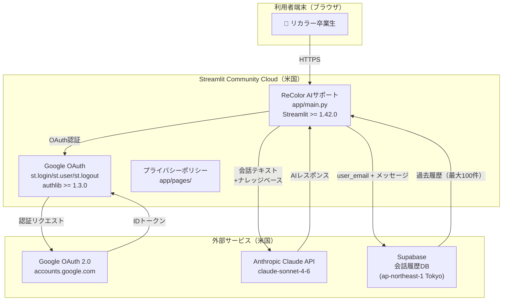
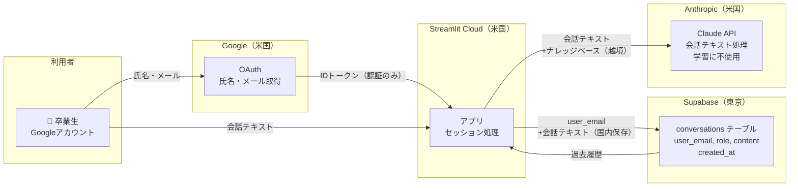
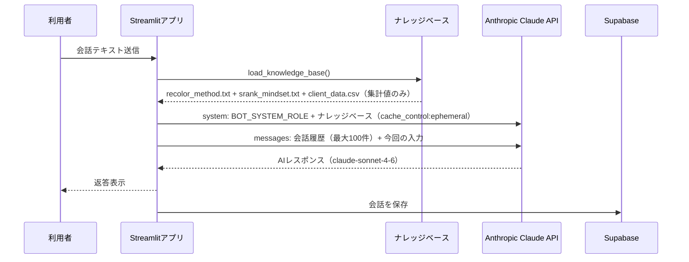

# ReColor AIサポート 情報システム部門報告書

> 本資料は対象リポジトリの自動収集とヒアリングに基づく、**2026-07-09** 時点のスナップショットです。
> インフラ・運用設定の網羅性を保証するものではなく、`[不明/未定]` のサジェスト項目は記入・確認が必要です。
> 前回報告書（2026-06-29）からの差分を重点的に記載します。

作成者：小家 真由（koie.mayu_cs@recolor-inc.net）  
作成日：2026-07-09

---

## §0 エグゼクティブサマリ・公開判定

### 公開判定

| 項目 | 内容 |
|---|---|
| **判定** | ⚠️ **CONDITIONAL GO** |
| 対象 | 社内限定β公開（リカラー卒業生のみ） |
| 条件 | 下記ブロッカー3件を解消後、情シス再確認 |
| 再審査時期 | ブロッカー解消後、速やかに |
| 承認者 | 情報システム部門（未定） |

### 前回（2026-06-29）との差分サマリ

| ブロッカーID | 内容 | 前回 | 今回 |
|---|---|---|---|
| ① | ユーザー認証 | ✗ 未実装 | ✅ Google OAuth実装済み |
| ② | レート制限 | ✗ 未実装 | ✅ セッション上限20件実装 |
| ③ | データ保存ポリシー | ✗ 未定 | △ PP更新済み・保存期間は未定義 |
| ④ | 利用規約・PP | ✗ 未存在 | ✅ ページ実装・公開済み |
| ⑤ | インシデント対応フロー | ✗ 未存在 | ✅ ドキュメント整備済み |

### 現在の公開ブロッカー（残存3件）

| # | 重大度 | 内容 | 対応方針 |
|---|---|---|---|
| B-1 | **High** | Google OAuth にドメイン・メール制限なし。現状、任意のGoogleアカウントでログイン可能 | メールホワイトリスト or ドメイン制限を実装 |
| B-2 | **Medium** | 会話データの保存期間が未定義。Supabaseに無期限保存されている | 保存期間をPP・運用規程に明記し、自動削除ロジックを実装 |
| B-3 | **Medium** | Anthropic APIコスト上限が未設定。利用急増時の青天井リスクあり | Anthropicコンソールで月額上限アラート／ハードリミットを設定 |

### 充足状況サマリ

| § | セクション | 状況 | 備考 |
|---|---|---|---|
| 1 | 基本情報 | ◯ | |
| 2 | スケール・ロードマップ | △ | DAU・目標数未定 |
| 3 | フェーズ別差分 | △ | 正式版の認証方針は検討中 |
| 4 | システム構成 | ◯ | |
| 5 | データ取り扱い | △ | 保存期間未定義（B-2） |
| 6 | AI利用 | ◯ | |
| 7 | 外部送信・第三者提供 | ◯ | |
| 8 | 認証・認可 | △ | アクセス制限なし（B-1） |
| 9 | 端末・ネットワーク要件 | ✗ | 制限なし（任意端末からアクセス可） |
| 10 | セキュリティ対策 | △ | ヘッダー一部欠如 |
| 11 | ログ・監視・インシデント | ◯ | |
| 12 | 可用性・運用 | △ | RTO/RPO未定 |
| 13 | コスト・キャパシティ | △ | 上限未設定（B-3） |
| 14 | 法令・コンプライアンス | △ | 保存期間記載要更新 |
| 15 | 既知のリスク・残課題 | ◯ | 本章参照 |
| 16 | サジェスト項目 | — | 本章参照 |

---

## §1 基本情報

| 項目 | 内容 | 根拠 |
|---|---|---|
| サービス名 | ReColor AIサポート | [出典: README.md] |
| 公開区分 | toC（リカラー卒業生向け） | [ヒアリング] |
| サービスの性質 | AI恋愛相談チャットボット（Googleログイン必須） | [出典: app/main.py] |
| 対象利用者 | リカラー卒業生（元生徒） | [ヒアリング] |
| フェーズ | β公開準備中（社内確認段階） | [ヒアリング] |
| システム責任者 | 小家 真由 | [ヒアリング] |
| 利用者サポート窓口 | info@recolor-inc.net | [出典: app/pages/1_プライバシーポリシー.py] |
| 情シス→運用連絡先 | koie.mayu_cs@recolor-inc.net | [出典: docs/incident-response.md] |
| 公開URL（予定） | https://rclchatfollow.streamlit.app | [推定: Streamlit Cloud設定] |
| 事業者名 | リカラー株式会社 | [出典: app/pages/2_利用規約.py] |

---

## §2 スケール・ロードマップ

| 項目 | 内容 | 根拠 |
|---|---|---|
| 想定DAU | [不明/未定] | [要確認] |
| 目標アカウント数 | 数十名（卒業生規模） | [ヒアリング] |
| βリリース予定 | 2026年7月中旬（調整中） | [ヒアリング] |
| 正式リリース | [不明/未定] | [要確認] |
| スケール方針 | Streamlit Cloud の自動スケール（無料プラン） | [推定] |

---

## §3 フェーズ別差分（β / 正式版）

| 項目 | β（現在） | 正式版（予定） |
|---|---|---|
| 認証 | Google OAuth（ドメイン制限なし） | ドメイン制限 or 招待制を検討 |
| レート制限 | セッションあたり20件 | API単位の制限強化を検討 |
| 課金・料金 | 無料 | 無料継続予定 |
| 公開範囲 | 卒業生限定（実態はURL知っていれば誰でもログイン可） | ホワイトリスト or 招待制 |
| SLA | なし | [不明/未定] |
| データ保存 | Supabase（無期限） | 保存期間・削除ポリシーを整備 |

---

## §4 システム構成・アーキテクチャ

### §4.1 システム全体構成図

### §4.2 技術スタック

| 層 | 技術 | バージョン | 根拠 |
|---|---|---|---|
| フロントエンド | Streamlit | >=1.42.0 | [出典: requirements.txt] |
| 言語 | Python | 3.x | [推定] |
| AI SDK | anthropic | >=0.49.0 | [出典: requirements.txt] |
| AIモデル | claude-sonnet-4-6 | — | [出典: app/config.py] |
| 認証ライブラリ | authlib | >=1.3.0 | [出典: requirements.txt] |
| DB クライアント | supabase-py | >=2.0.0 | [出典: requirements.txt] |
| データ処理 | pandas | >=2.2.0 | [出典: requirements.txt] |

### §4.3 ホスティング・インフラ

| 項目 | 内容 | 根拠 |
|---|---|---|
| ホスティング | Streamlit Community Cloud（無料プラン） | [推定] |
| リージョン | 米国（Streamlit管理） | [推定] |
| DB | Supabase（ap-northeast-1 Tokyo） | [ヒアリング] |
| ソースリポジトリ | github.com/koiemayucs-rgb/afterfollow-bot（Public） | [推定] |
| カスタムドメイン | なし（rclchatfollow.streamlit.app） | [推定] |
| CDN | Streamlit Cloud 内蔵（管理外） | [推定] |

> ⚠️ リポジトリがPublicのため、ソースコードが一般公開されている。APIキー等はStreamlit Secretsで管理されており、コードには含まれていない。

---

## §5 データ取り扱い

### §5.1 データ取り扱い・外部送信・越境図

### §5.2 取り扱いデータ一覧

| データ種別 | 内容 | 保存先 | 保存期間 | 個人情報 | 根拠 |
|---|---|---|---|---|---|
| Googleアカウント情報 | 氏名・メールアドレス | セッションのみ（メモリ） | セッション終了まで | ◯ | [出典: app/main.py:264] |
| 会話テキスト（ユーザー） | 恋愛相談の入力内容 | Supabase（東京） | **[不明/未定]**（無期限保存中） | ◯ | [出典: app/db.py] |
| 会話テキスト（AI返答） | AIの返答内容 | Supabase（東京） | **[不明/未定]**（無期限保存中） | — | [出典: app/db.py] |
| ナレッジベース | recolor_method.txt等（匿名） | アプリ内メモリのみ | セッション中 | ✗ | [出典: app/knowledge_base.py] |
| システムログ | Streamlit管理ログ | Streamlit Cloud | Streamlit社ポリシーに従う | △ | [推定] |

### §5.3 データ主体の権利対応

| 権利 | 対応状況 | 根拠 |
|---|---|---|
| 開示請求 | info@recolor-inc.net で受付（30日以内対応） | [出典: app/pages/1_プライバシーポリシー.py] |
| 訂正・削除 | 手動対応（管理画面なし） | [推定] |
| 利用停止 | 手動でSupabaseからレコード削除 | [推定] |
| データポータビリティ | [不明/未定] | [要確認] |

---

## §6 AI利用

### §6.1 AI送信フロー図

### §6.2 AI利用詳細

| 項目 | 内容 | 根拠 |
|---|---|---|
| 利用AI | Anthropic Claude（claude-sonnet-4-6） | [出典: app/config.py] |
| AIへ渡す入力 | ① システムプロンプト（人格定義） ② ナレッジベース（recolor_method.txt等） ③ 会話履歴（最大100件） ④ 今回のユーザー入力（恋愛相談テキスト） | [出典: app/claude_client.py, app/prompts.py] |
| 個人情報のAI送信 | 会話テキストに含まれる個人情報（実名・相手の情報等）がAnthropicに送信される | [推定] |
| 学習への利用 | **なし**（Anthropic商用API: 学習に使用しないポリシー） | [出典: app/pages/1_プライバシーポリシー.py] |
| プロンプトキャッシュ | cache_control: ephemeral でナレッジベースをキャッシュ | [出典: app/claude_client.py] |
| ガードレール | 人格プロンプトで「断定的な結論を出さない」等を規定 | [出典: app/prompts.py] |
| Prompt Injection対策 | なし（未実装） | [推定] |
| 最大トークン数 | 2048 tokens/レスポンス | [出典: app/config.py] |

---

## §7 外部送信・第三者提供

### §7.1 委託先・サブプロセッサ一覧

| 委託先 | 用途 | 所在地 | 越境 | データ種別 |
|---|---|---|---|---|
| Google LLC | OAuth認証（氏名・メール取得） | 米国 | ◯ | 氏名・メールアドレス |
| Anthropic, Inc. | AIレスポンス生成 | 米国 | ◯ | 会話テキスト・ナレッジベース |
| Streamlit, Inc. | アプリホスティング・ログ | 米国 | ◯ | システムログ |
| Supabase, Inc. | 会話履歴DB | 日本（Tokyo） | ✗ | メールアドレス・会話テキスト |

### §7.2 電気通信事業法の外部送信規律

| 項目 | 内容 | 根拠 |
|---|---|---|
| Cookie利用 | Streamlit管理Cookie（HttpOnly・Secure・SameSite=Laxを実測で確認済み） | [推定] |
| 外部送信対象情報 | 会話内容がAnthropicへ送信（米国越境） | [出典: app/claude_client.py] |
| 通知・公表 | プライバシーポリシーにサブプロセッサとして記載 | [出典: app/pages/1_プライバシーポリシー.py] |

---

## §8 認証・認可・アクセス制御

| 項目 | 内容 | 根拠 |
|---|---|---|
| 認証方式 | Google OAuth 2.0（Streamlit built-in auth） | [出典: app/main.py:15] |
| ログイン必須 | ◯（未認証ユーザーはログイン画面のみ表示） | [出典: app/main.py:15-83] |
| ロール・権限 | なし（全ログインユーザーが同一権限） | [推定] |
| **アクセス制限** | **⚠️ なし。任意のGoogleアカウントでログイン可能（B-1）** | [出典: app/main.py] |
| ドメイン制限 | 未実装 | [推定] |
| メールホワイトリスト | 未実装 | [推定] |
| セッション管理 | Streamlit built-in（cookie_secret設定済み） | [出典: .streamlit/secrets.toml.example] |
| ログアウト | 実装済み（st.logout()） | [出典: app/main.py:292] |
| MFA | なし（Google側のMFAに依存） | [推定] |
| 管理者アカウント | なし（管理画面未実装） | [推定] |

---

## §9 端末・ネットワーク要件

| 項目 | 内容 | 根拠 |
|---|---|---|
| アクセス制限 | なし（インターネット接続可能な端末であればアクセス可） | [推定] |
| IP制限 | なし | [推定] |
| VPN要件 | なし | [推定] |
| SSO連携 | なし（Google OAuthのみ） | [推定] |
| 動作確認端末 | [不明/未定] | [要確認] |

---

## §10 セキュリティ対策

### §10.1 実URL実測結果（2026-07-09）

実測URL: `https://rclchatfollow.streamlit.app`

| 項目 | 実測値 | 評価 |
|---|---|---|
| TLS | HTTPS（リダイレクト確認済み） | ✅ |
| HSTS | 未確認（Streamlit管理） | △ |
| Content-Security-Policy | 未確認 | △ |
| X-Frame-Options | 未確認 | △ |
| X-Content-Type-Options | 未確認 | △ |
| Cookie属性 | Secure=◯ / HttpOnly=◯ / SameSite=Lax | ✅ [出典: curl実測] |
| 認証必須 | ◯（303リダイレクト→Google OAuth） | ✅ [出典: curl実測] |
| CORS | Streamlit管理（未確認） | △ |

> 実測コマンド: `curl -sI https://rclchatfollow.streamlit.app`  
> 結果: 303 → share.streamlit.io/-/auth/app（認証リダイレクト）。Cookie属性はSet-Cookie行で確認。

### §10.2 セキュリティ対策一覧

| 項目 | 内容 | 根拠 |
|---|---|---|
| APIキー管理 | Streamlit Secrets（環境変数）で管理。コードには含まれない | [出典: .streamlit/secrets.toml.example] |
| ソースコード | Publicリポジトリ。シークレットは含まれない | [推定] |
| レート制限 | セッションあたり20件（ページリロードで回避可能） | [出典: app/main.py:261] |
| SQLインジェクション | Supabase SDKのパラメータ化クエリを使用 | [出典: app/db.py] |
| XSS | HTMLエスケープ実装（会話バブル部分） | [出典: app/main.py:313-316] |
| 依存脆弱性スキャン | 未実施 | [推定] |
| SAST/DAST | 未実施 | [推定] |
| 脆弱性診断 | 未実施 | [要確認] |

---

## §11 ログ・監視・インシデント対応

| 項目 | 内容 | 根拠 |
|---|---|---|
| アプリログ | Streamlit Cloud管理ログ | [推定] |
| API使用量ログ | Anthropicコンソールで確認可 | [出典: docs/incident-response.md] |
| 会話ログ | Supabase conversationsテーブル | [出典: app/db.py] |
| 監視 | 手動確認のみ（自動監視なし） | [推定] |
| インシデント対応フロー | 整備済み（P0〜P3の重大度定義・初動フロー） | [出典: docs/incident-response.md] |
| 個人情報漏えい時の報告 | 72時間以内に個人情報保護委員会へ報告 | [出典: docs/incident-response.md] |
| 通知義務 | 影響を受けるユーザーへのメール通知 | [出典: docs/incident-response.md] |

---

## §12 可用性・運用

| 項目 | 内容 | 根拠 |
|---|---|---|
| 可用性目標（SLA） | なし（Streamlit Community Cloud依存） | [不明/未定] |
| RTO（目標復旧時間） | [不明/未定] | [要確認] |
| RPO（目標復旧時点） | [不明/未定] | [要確認] |
| バックアップ | Supabaseの自動バックアップ（プランによる） | [不明/未定] |
| 復旧テスト | 未実施 | [推定] |
| 保守体制 | 小家 真由（1名） | [ヒアリング] |
| デプロイ | GitHubへのpush → Streamlit Cloud自動デプロイ | [推定] |

---

## §13 コスト・キャパシティ・契約

### §13.1 コスト試算

| サービス | プラン | 月額概算 | 根拠 |
|---|---|---|---|
| Streamlit Community Cloud | 無料 | $0 | [推定] |
| Anthropic API | 従量課金 | **上限未設定**（B-3） | [ヒアリング] |
| Supabase | 無料プラン（500MB） | $0 | [ヒアリング] |

> Anthropic APIの試算（参考）: claude-sonnet-4-6は入力$3/MTok、出力$15/MTok。ユーザー50名×1日10件×300tokens/件 ≒ 月$2〜$5程度（現スケール）。ただし上限設定がないため急増リスクあり。

### §13.2 契約

| 項目 | 内容 | 根拠 |
|---|---|---|
| Anthropic利用規約 | 商用API利用規約に同意（学習不使用確認済み） | [出典: app/pages/1_プライバシーポリシー.py] |
| Supabase利用規約 | 無料プラン利用規約 | [推定] |
| Streamlit利用規約 | Community Cloud利用規約 | [推定] |
| DPA（データ処理契約） | [不明/未定] | [要確認] |

---

## §14 法令・コンプライアンス

### §14.1 個人情報保護法

| 項目 | 内容 | 根拠 |
|---|---|---|
| プライバシーポリシー | 公開済み（アプリ内リンクあり） | [出典: app/pages/1_プライバシーポリシー.py] |
| 取得情報の明示 | Googleアカウント情報・会話内容を明記 | [出典: app/pages/1_プライバシーポリシー.py] |
| 利用目的の明示 | サービス提供・品質向上・障害対応を明記 | [出典: app/pages/1_プライバシーポリシー.py] |
| 第三者提供の明示 | Google・Anthropic・Supabaseを委託先として明記 | [出典: app/pages/1_プライバシーポリシー.py] |
| 越境移転の明示 | 米国への送信を記載 | [出典: app/pages/1_プライバシーポリシー.py] |
| 保存期間 | **未記載（B-2）** | [推定] |
| 開示請求対応 | 30日以内対応を明記 | [出典: app/pages/1_プライバシーポリシー.py] |

### §14.2 消費者向け法令（toC）

| 法令 | 対応状況 | 根拠 |
|---|---|---|
| 特定商取引法 | 利用規約ページに表示あり（無料サービスのため最低限） | [出典: app/pages/2_利用規約.py] |
| 景表法 | AI返答の正確性を保証しない旨を免責事項に明記 | [出典: app/pages/2_利用規約.py] |
| 消費者契約法 | 過度な免責条項なし（確認済み） | [推定] |
| 電気通信事業法（外部送信） | PPにサブプロセッサを明記して対応 | [出典: app/pages/1_プライバシーポリシー.py] |

### §14.3 契約事項（toB）

該当なし（公開区分 = toC のため）

---

## §15 既知のリスク・残課題

| 重大度 | ID | 内容 | 状態 |
|---|---|---|---|
| **High** | B-1 | 任意のGoogleアカウントでアクセス可能。リカラー卒業生以外もログインできる | 未対応 |
| **Medium** | B-2 | 会話データが無期限保存。保存期間・削除ポリシーが未定義 | 未対応 |
| **Medium** | B-3 | Anthropic APIコスト上限未設定。利用急増時の青天井リスク | 未対応 |
| **Medium** | R-1 | レート制限がセッションベースのため、ページリロードで回避可能 | 緩和策として実装済み（完全対応は認証強化後） |
| **Low** | R-2 | ソースコードがPublicリポジトリ。内部ロジック・プロンプト設計が公開状態 | 許容（シークレットは含まれない） |
| **Low** | R-3 | 依存パッケージの脆弱性スキャン未実施 | 未対応 |
| **Low** | R-4 | 管理者用ダッシュボードなし。会話ログの閲覧・削除はSupabase直接操作が必要 | 許容（β段階） |
| **Low** | R-5 | Prompt Injection対策未実装 | 未対応（低リスク評価） |

---

## §16 サジェスト項目（記入・対応候補）

### Blocker（公開前に解消必須）

| 優先度 | 項目 | 対応方法 |
|---|---|---|
| 🔴 最優先 | **B-1: Googleログインのアクセス制限** | `st.user.email` でドメイン（例: @recolor-inc.net）またはメールリストで制限。もしくは招待制URLを導入 |
| 🔴 最優先 | **B-2: 会話データの保存期間定義** | 保存期間（例: 1年）を決定し、PPを更新。Supabaseに自動削除の定期ジョブを設定 |
| 🔴 最優先 | **B-3: Anthropic APIコスト上限設定** | Anthropicコンソール → Settings → Limits で月額上限アラート・ハードリミットを設定 |

### Before Beta（β公開前に対応推奨）

| 項目 | 内容 |
|---|---|
| HTTPセキュリティヘッダーの確認 | CSP・X-Frame-Options等がStreamlit Cloudで設定されているか確認 |
| Supabaseバックアップ設定の確認 | 無料プランのバックアップ有無を確認。必要なら有料プランへ移行 |
| 動作確認端末の明示 | 動作確認済みOS・ブラウザを文書化 |
| レート制限の強化 | ログインユーザー単位での日次制限をSupabaseで管理 |

### Before Commercial（正式リリース前）

| 項目 | 内容 |
|---|---|
| RTO/RPO定義 | 障害時の目標復旧時間・目標復旧時点を定義 |
| 脆弱性診断 | 外部業者による診断の実施 |
| DPA（データ処理契約） | Anthropic・Supabaseとのデータ処理契約の確認 |
| 管理者ダッシュボード | 会話ログ閲覧・ユーザー管理のための管理画面 |
| データポータビリティ対応 | ユーザーが自分の会話履歴をエクスポートできる機能 |

### 任意

| 項目 | 内容 |
|---|---|
| 依存パッケージの脆弱性スキャン | `pip audit` または GitHub Dependabot で定期スキャン |
| Prompt Injection対策 | 入力フィルタリングの導入検討 |
| 想定DAU・月間コスト試算の精緻化 | β公開後の実績をもとに見直し |
